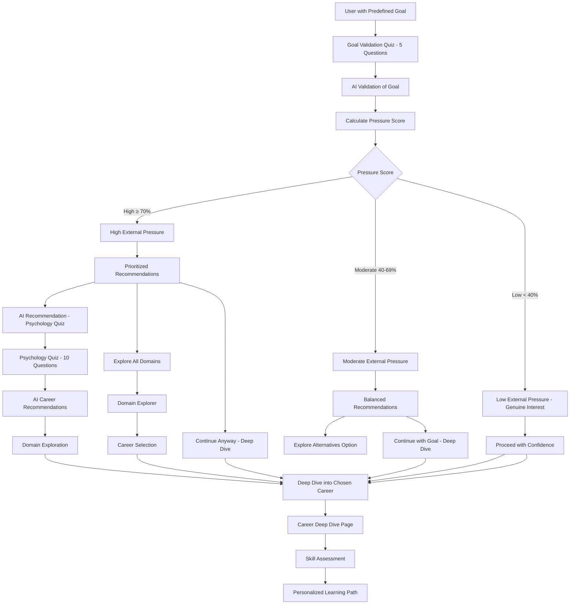

# User Flow: Goal Already Set

This document outlines the complete flow for users who have already set a career goal when using the Career Advisor platform.

## Flow Overview

## Detailed Steps

### 1. Goal Validation Quiz
Users who have already set a career goal are presented with a 5-question validation quiz designed to assess the alignment between their motivations and their chosen career path.

**Questions:**
1. What primarily drives your interest in this field?
2. Where do you see yourself in this field in 10 years?
3. When faced with a difficult problem in your field, what's your approach?
4. How do you prefer to learn new skills in your field?
5. Rate your confidence in pursuing this goal (1-5 scale)

### 2. AI Validation Process
The user's answers are sent to an AI career counselor with a structured prompt that includes:
- The user's stated career goal
- All 5 validation quiz answers
- Instructions to assess alignment and provide actionable insights

**AI Analysis Tasks:**
1. Determine alignment between motivations and career demands
2. Assign validation status:
   - "Excellent Match" - Perfect alignment
   - "Good Foundation" - Solid but improvable alignment
   - "Requires Reflection" - Significant misalignment
3. Provide a concise validation summary
4. Offer two actionable insights:
   - "Your Superpower for this Goal"
   - "Something to Keep in Mind"

### 3. Pressure Score Calculation
Based on the AI's validation status:
- "Excellent Match" → 20% pressure score (low pressure)
- "Good Foundation" → 50% pressure score (moderate pressure)
- "Requires Reflection" → 80% pressure score (high pressure)

### 4. Recommendation Flow

#### High Pressure (≥ 70%)
**Primary Option:** AI Recommendation
- Takes user through the same 10-question psychology quiz as users without goals
- AI generates personalized career recommendations
- User explores recommended domains and careers

**Secondary Option:** Explore All Domains
- Direct access to domain explorer
- User can browse all career domains

**Tertiary Option:** Continue Anyway
- Proceeds directly to deep-dive of their chosen career

#### Moderate Pressure (40-69%)
**Balanced Approach:**
- Option to explore alternatives
- Option to continue with their chosen goal

#### Low Pressure (< 40%)
**Direct Path:**
- Proceed with confidence to deep-dive of chosen career

### 5. Deep Dive Page
Regardless of how users arrive at this point, they all access the same career deep-dive page that provides:
- Detailed career information
- Day-in-the-life insights
- Career trajectory
- Skill requirements
- Market information

### 6. Skill Assessment
After exploring the career in depth, users proceed to:
- Skill assessment to determine current proficiency level
- Personalized learning path creation

## Technical Implementation

### Components
1. `GoalValidation.tsx` - Mobile-first validation quiz interface
2. `goalValidation.ts` - Service layer for AI validation and scoring
3. Psychology Quiz (existing) - 10-question quiz for AI recommendations
4. Domain Explorer (existing) - Career domain browsing
5. Career Deep Dive (existing) - Detailed career information pages

### API Integration
- Google Generative AI for AI validation
- Structured prompt based on `a.md` template
- JSON response parsing for validation status and insights

### Data Flow
1. User answers 5 validation questions
2. Answers + goal sent to AI validation service
3. AI returns validation status and insights
4. Pressure score calculated from validation status
5. Appropriate recommendations shown based on pressure score
6. User chooses path forward
7. All paths converge at career deep-dive page
8. Proceed to skill assessment and learning path